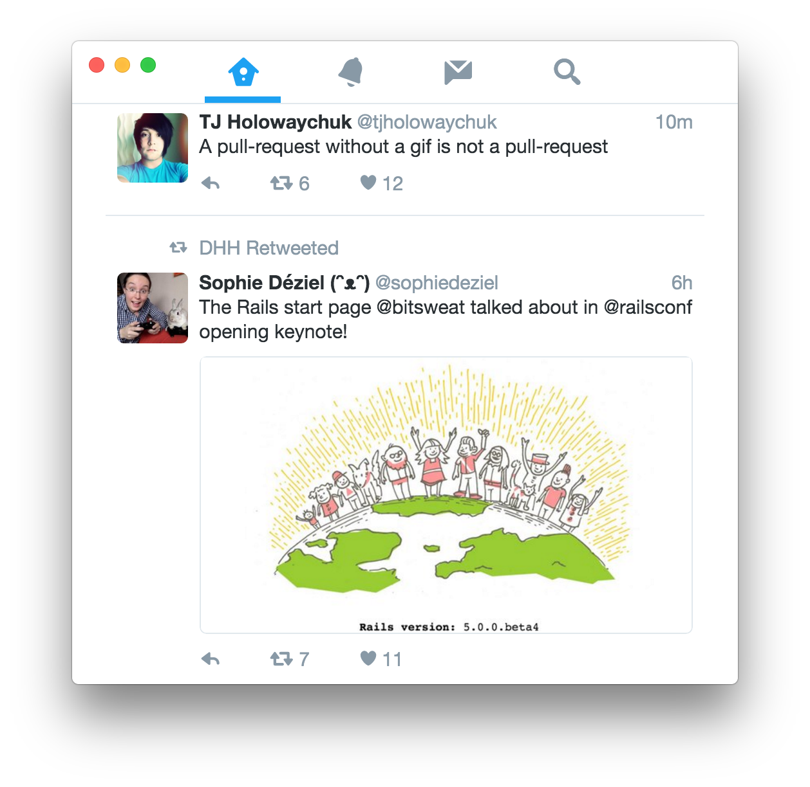
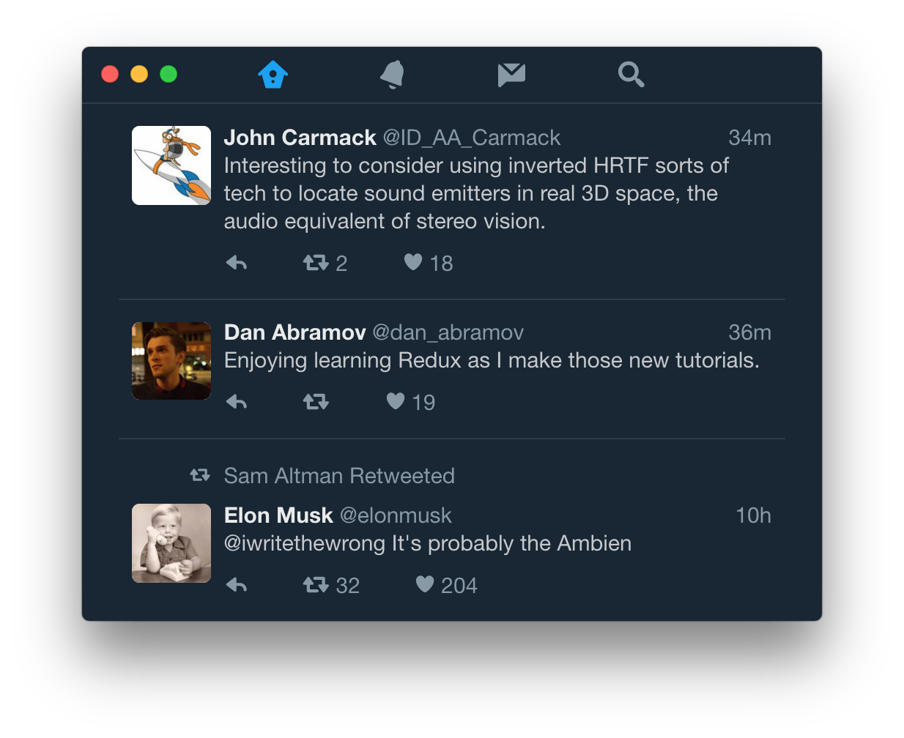
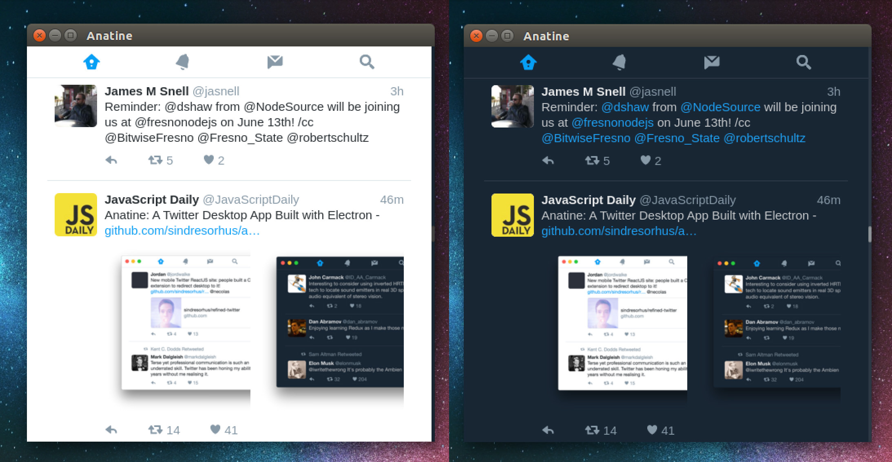
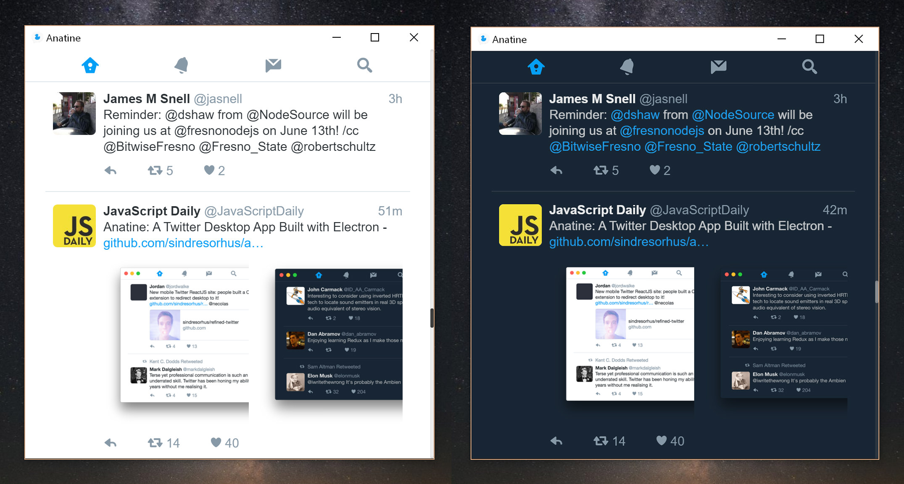

# Deprecated

Me and others put a lot of work into this project to make the Mobile Twitter site great as a desktop app. I've chosen to deprecate it now, as it's impossible to keep up with the Mobile Twitter ever changing React class names. I don't have time to update a bunch of CSS-selectors every other week. Thanks for all the fish.

Happy to let anyone else take over if interested.

---

# Anatine 

> Pristine Twitter app

This app is based the awesome [Mobile Twitter](https://mobile.twitter.com) site, but modifies a lot of things and makes it more usable on the desktop.

<br>
<div align="center">
	<a href="https://github.com/sindresorhus/anatine/releases/latest" align="center">
		
	</a>
</div>


## Features

### Dark mode

You can toggle dark mode in the `Anatine` menu or with <kbd>Cmd</kbd> <kbd>Shift</kbd> <kbd>D</kbd> / <kbd>Ctrl</kbd> <kbd>Shift</kbd> <kbd>D</kbd>.

<div align="center">
	
</div>

### Background behavior

When closing the window, the app will continue running in the background, in the dock on macOS and the tray on Linux/Windows. Right-click the dock/tray icon and choose `Quit` to completely quit the app. On macOS, click the dock icon to show the window. On Linux, right-click the tray icon and choose `Toggle` to toggle the window. On Windows, click the tray icon to toggle the window.

### Keyboard shortcuts

- New tweet: <kbd>n</kbd>
- New DM: <kbd>m</kbd>
- Send tweet/DM: <kbd>Cmd</kbd> <kbd>Enter</kbd> or <kbd>Ctrl</kbd> <kbd>Enter</kbd>
- Go to Home: <kbd>g</kbd> <kbd>h</kbd> or <kbd>Ctrl</kbd> <kbd>1</kbd>  or <kbd>Cmd</kbd> <kbd>1</kbd>
- Go to Notifications: <kbd>g</kbd> <kbd>n</kbd> or <kbd>Ctrl</kbd> <kbd>2</kbd>  or <kbd>Cmd</kbd> <kbd>2</kbd>
- Go to Messages: <kbd>g</kbd> <kbd>m</kbd> or <kbd>Ctrl</kbd> <kbd>3</kbd>  or <kbd>Cmd</kbd> <kbd>3</kbd>
- Go to Search: <kbd>/</kbd> or <kbd>Ctrl</kbd> <kbd>4</kbd>  or <kbd>Cmd</kbd> <kbd>4</kbd>
- Go to Profile: <kbd>g</kbd> <kbd>p</kbd> or <kbd>Ctrl</kbd> <kbd>5</kbd>  or <kbd>Cmd</kbd> <kbd>5</kbd>
- Go to Likes: <kbd>g</kbd> <kbd>l</kbd>
- Go to Lists: <kbd>g</kbd> <kbd>i</kbd>
- Go to previous page: <kbd>Delete</kbd> or <kbd>Backspace</kbd>
- Next tab: <kbd>Ctrl</kbd> <kbd>Tab</kbd>
- Previous tab: <kbd>Ctrl</kbd> <kbd>Shift</kbd> <kbd>Tab</kbd>
- Go to next tweet: <kbd>j</kbd>
- Go to previous tweet: <kbd>k</kbd>
- Go to next photo: <kbd>→</kbd>
- Go to previous photo: <kbd>←</kbd>
- Page down: <kbd>Ctrl</kbd> <kbd>d</kbd>
- Page up: <kbd>Ctrl</kbd> <kbd>u</kbd>
- Scroll to top: <kbd>g</kbd> <kbd>g</kbd>
- Scroll to bottom: <kbd>G</kbd>


## Install

*macOS 10.9+, Windows 7+ & Linux are supported.*

### macOS

#### [Homebrew Cask](http://caskroom.io)

```
$ brew update && brew cask install anatine
```

#### Manually

[**Download**](https://github.com/sindresorhus/anatine/releases/latest), unzip, and move `Anatine.app` to the `/Applications` directory.

### Linux



[**Download**](https://github.com/sindresorhus/anatine/releases/latest) and unzip to some location.

To add a shortcut to the app, create a file in `~/.local/share/applications` called `anatine.desktop` with the following contents:

```
[Desktop Entry]
Name=Anatine
Exec=/full/path/to/folder/Anatine
Terminal=false
Type=Application
Icon=/full/path/to/folder/Anatine/resources/app/static/Icon.png
```

#### Snap package

```
$ sudo snap install anatine
```

[Read more...](https://github.com/claudioandre/packages/tree/master/anatine)


### Windows



[**Download**](https://github.com/sindresorhus/anatine/releases/latest) and unzip to some location.


---


## Dev

Built with [Electron](http://electron.atom.io).

###### Commands

- Init: `$ npm install`
- Run: `$ npm start`
- Build macOS: `$ npm run build:macos`
- Build Linux: `$ npm run build:linux`
- Build Windows: `$ npm run build:windows`
- Build all: `$ brew install wine` and `$ npm run build` *(macOS only)*


## Related

- [Refined Twitter](https://github.com/sindresorhus/refined-twitter) - Chrome extension of this app
- [Caprine](https://github.com/sindresorhus/caprine) - Facebook Messenger app


## Created by

- [Sindre Sorhus](https://github.com/sindresorhus)
- [Paul Molluzzo](https://github.com/paulmolluzzo)
- [Daniel Pham](https://github.com/danhp)
- [Contributors…](https://github.com/sindresorhus/anatine/graphs/contributors)


## License

MIT © [Sindre Sorhus](https://sindresorhus.com)
